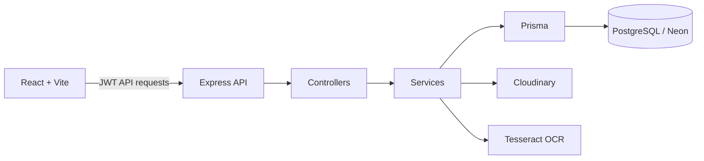

# FinMate AI

FinMate AI is a full-stack personal finance platform that combines transaction tracking, receipt OCR, shared expenses, analytics, forecasting, and an explainable rule-based financial advisor.

## Highlights

- Secure JWT authentication with refresh-token rotation and protected routes.
- Personal transactions, category budgets, shared groups, settlements, and receipt-to-transaction conversion.
- Cloudinary-backed receipt storage with OCR extraction.
- Insights, merchant intelligence, recurring-payment detection, forecasts, and explainable recommendations.
- Smart notification center with preferences, read state, and per-user duplicate prevention.

## Architecture



The backend retains the established `routes → controllers → services → Prisma` flow. The AI advisor and notifications reuse existing analytics and prediction services instead of duplicating calculations.

## Repository layout

```text
finmate-backend/   Express API, Prisma schema/migrations, tests, OpenAPI docs
finmate-frontend/  React/Vite client and reusable UI components
.github/workflows/ Independent backend and frontend CI pipelines
```

## Technology stack

- Frontend: React, Vite, Tailwind CSS, Axios, Chart.js
- Backend: Node.js, Express, Prisma, Zod, JWT, Multer
- Data/services: PostgreSQL (Neon), Cloudinary, Tesseract.js
- Operations: Docker Compose, GitHub Actions, Helmet, rate limiting, Swagger UI

## Local setup

1. Copy [backend environment example](finmate-backend/.env.example) to `finmate-backend/.env` and set real secrets.
2. Copy [frontend environment example](finmate-frontend/.env.example) to `finmate-frontend/.env`.
3. In `finmate-backend`, run `npm ci`, `npx prisma migrate dev`, and `npm run dev`.
4. In `finmate-frontend`, run `npm ci` and `npm run dev`.

The API health endpoint is `/health`; interactive API documentation is available at `/api-docs` in development.

## Docker

Copy the root [.env.example](.env.example) to `.env`, set secure JWT secrets, then run:

```bash
docker compose up --build
```

The web app is served at `http://localhost:8080`, and the API at `http://localhost:5000`. Docker Compose starts a local PostgreSQL database; substitute a Neon `DATABASE_URL` for hosted deployment.

## Deployment

- **Frontend (Vercel):** deploy `finmate-frontend`; set `VITE_API_URL=https://your-api.example.com/api`. The included `vercel.json` preserves client-side routing.
- **Backend (Railway/Render):** deploy `finmate-backend`; set `DATABASE_URL`, both JWT secrets, `CORS_ORIGIN`, and Cloudinary credentials. Run `npx prisma migrate deploy` before serving. `railway.toml` provides Railway defaults.
- **Database (Neon):** use the pooled production connection URL in `DATABASE_URL`; apply committed Prisma migrations during deploy.

Never commit `.env` files or expose the API documentation publicly unless `ENABLE_API_DOCS=true` is an intentional choice.

## API overview

All protected endpoints require `Authorization: Bearer <accessToken>`. API documentation covers Auth, Transactions, Budgets, Groups, Receipts, Insights, Predictions, AI Advisor, and Notifications, including request schemas and common error responses.

## Database overview

`User` owns transactions, budgets, receipts, refresh tokens, notifications, and one preference record. Shared groups use membership, expenses, and shares. The schema indexes common owner/date and notification read-state queries; migrations live in `finmate-backend/prisma/migrations`.

## Screenshots

| Dashboard | Insights | Notifications |
| --- | --- | --- |
| _Add dashboard screenshot_ | _Add insights screenshot_ | _Add notifications screenshot_ |

## Quality checks

```bash
cd finmate-backend && npm test && npx prisma validate && npm run build
cd ../finmate-frontend && npm run build
```

## Roadmap

- Web push or mobile notification delivery adapter.
- Scheduled job runner/queue for notification generation.
- End-to-end API tests with an isolated database.
- Observability export to a managed logging/metrics provider.
